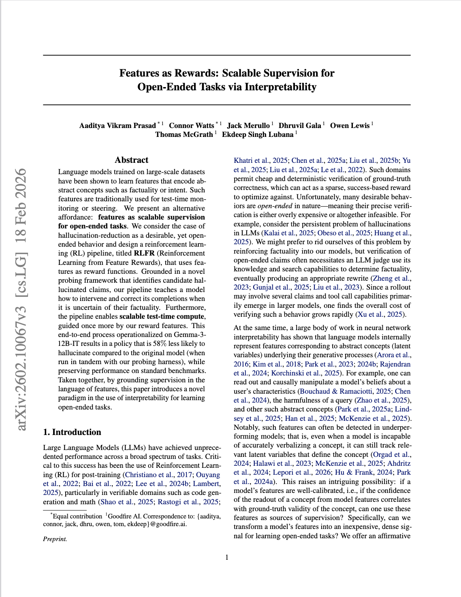

<h1 align="center">RLFR Replication</h1>

<p align="center">
  <em>A reduced-scale replication of Goodfire's <strong>Reinforcement Learning from Feature Rewards</strong> — using interpretability features as reward functions to reduce hallucination in open-ended generation.</em>
</p>

<p align="center">
  
  
  
  
  
  
  
</p>

---

## About

This repository is a reduced-scale replication of Goodfire's **"Features as Rewards: Scalable
Supervision for Open-Ended Tasks via Interpretability"** (Prasad, Watts, Merullo, Gala, Lewis,
McGrath & Lubana, 2026) — [arXiv:2602.10067](https://arxiv.org/abs/2602.10067).

The paper introduces **RLFR** (Reinforcement Learning from Feature Rewards). Rather than paying an
LLM judge to verify every open-ended claim a model produces, RLFR reads a model's *internal
features* — latent directions encoding abstract concepts such as factuality — and uses them
directly as a dense reward signal. A probing framework flags candidate hallucinated claims, and the
RL pipeline teaches the policy to intervene on and correct its own completions when it is uncertain
of their factuality. The same reward features then guide test-time compute. In the paper this
yields a Gemma-3-12B-IT policy that hallucinates 58% less than the base model while preserving
standard benchmark performance.

**What this replication does.** Qwen 3 8B activations are instrumented on LongFact++ via
vLLM-Hook. A factuality pipeline built on Gemini 2.5 Pro with retrieval acts as the oracle used to
train three probes — factuality, localization, and judging. To feed it, the pipeline generated a
**347M-token synthetic dataset at 4.7k tokens/sec on a single L40S**, producing **5.7M candidate
claims** validated at a **98% recovery rate**, with roughly **430k responses** evaluated end to end.

<p align="center">
  
</p>

## Status

**Paused.** Data collection and labelling are complete; the transformer probe is not yet
implemented. Work is on hold while the author is funded by Pivotal Research to work on RSPD.

| | |
| --- | --- |
| Synthetic generation | ✅ Complete — 347M tokens, 4.7k tok/s on one L40S |
| Claim extraction & validation | ✅ Complete — 5.7M candidate claims, 98% recovery |
| Response evaluation | ✅ Complete — ~430k responses |
| Linear probes | ✅ Training data collected and labelled |
| Transformer probe | ⬜ Not implemented |
| RL loop / test-time compute | ⬜ Not started |

## Funding

<p>
  
</p>

This project is funded by **[BlueDot Impact](https://bluedot.org/)**, which supports work on AI
safety and interpretability research.

<br clear="left">

## Pipeline

| Stage | What it does | Where |
| --- | --- | --- |
| 1. Synthetic generation | Batched vLLM sampling of long-form Qwen 3 8B answers to LongFact++ prompts, with activations captured via vLLM-Hook. | [`scripts/generate_model_response.py`](scripts/generate_model_response.py) |
| 2. Claim localization & verification | Extracts atomic factual claims from each response and labels them with the Gemini 2.5 Pro + retrieval oracle, producing probe training labels. | [`notebooks/entity_extraction_verification_pipeline.ipynb`](notebooks/entity_extraction_verification_pipeline.ipynb) |
| 3. Probing & intervention | Trains factuality / localization / judging probes on the captured activations, then prompts the model to correct claims the probes flag as likely hallucinated. | [`notebooks/rlfr_implementation.ipynb`](notebooks/rlfr_implementation.ipynb) |
| 4. Monitoring | Tracks probe scores and hallucination rate across runs. | [`notebooks/monitoring_pipeline.ipynb`](notebooks/monitoring_pipeline.ipynb) |

## Repository layout

```
.
├── configs/
│   └── experiment.yaml          # Seed and sampling counts for a replication run
├── data/
│   ├── long_factpp/             # LongFact++ prompts, saved as a HF dataset on disk
│   └── probe_training_data.csv  # Labelled claims used to fit the probes
├── docs/
│   ├── setup.md                 # Environment, CUDA and dependency install notes
│   └── assets/
├── notebooks/
│   ├── rlfr_implementation.ipynb                     # Main pipeline: prompts, probes, interventions
│   ├── rlfr_replication_test.ipynb                   # Minimal end-to-end smoke test
│   ├── entity_extraction_verification_pipeline.ipynb # Claim extraction + oracle labelling
│   ├── monitoring_pipeline.ipynb                     # Run monitoring
│   └── scratch/                                      # Exploratory notebooks, kept for reference
├── scripts/
│   ├── generate_model_response.py   # Batched vLLM generation over LongFact++
│   ├── batch_size_sweep.py          # Throughput sweep to pick a batch size
│   └── batch_test.slurm             # SLURM job for the above
├── pyproject.toml
└── uv.lock
```

## Environment

Pinned versions — the ones the recorded W&B runs were produced with:

| Component | Version |
| --- | --- |
| Python | 3.10.18 (CPython) |
| PyTorch | 2.6.0+cu124 |
| torchvision / torchaudio | 0.21.0+cu124 / 2.6.0+cu124 |
| vLLM | 0.8.5 |
| transformers | 4.57.6 |
| tokenizers | 0.22.2 |
| datasets | 4.8.5 |
| huggingface_hub | 0.36.2 |
| xformers | 0.0.29.post2 |
| numpy | 2.2.6 |
| pandas | 2.3.3 |
| wandb | 0.27.0 |
| google-genai | ≥ 2.7.0 |
| CUDA toolkit | 12.4 (wheels) / 12.8 (cluster module) |
| Hardware | NVIDIA L40S (48 GB, Ada) — up to 4 per SLURM job, 64 CPU |

Torch and vLLM are pinned exactly: vLLM builds against a specific torch ABI, so bumping one without
the other breaks the environment. See [`docs/setup.md`](docs/setup.md) for the full install sequence.

## Quick start

```bash
# Python 3.10 + uv
uv sync

# CUDA-matched torch/vLLM wheels (see docs/setup.md for why these need the extra indexes)
uv pip install torch==2.6.0 torchvision==0.21.0 torchaudio==2.6.0 \
  --index-url https://download.pytorch.org/whl/cu124
uv pip install vllm==0.8.5 \
  --extra-index-url https://wheels.vllm.ai/0.8.5/cu124 \
  --extra-index-url https://download.pytorch.org/whl/cu124 \
  --index-strategy unsafe-best-match
```

Then create a `.env` with the credentials the pipeline reads:

```
GEMINI_API_KEY=...     # claim verification oracle
WANDB_API_KEY=...      # run logging
HF_TOKEN=...           # dataset + model access
```

Generate the response corpus (on a GPU node):

```bash
sbatch scripts/batch_test.slurm             # SLURM
python scripts/generate_model_response.py   # or directly
```

`batch_test.slurm` and `scripts/generate_model_response.py` contain absolute cluster paths — edit
those to match your own filesystem before running.

## Notes

- `notebooks/scratch/` holds exploratory work kept for reference; it is not part of the pipeline.
- W&B run directories and generated `.jsonl` data are not tracked in git (see `.gitignore`).
- Never commit `.env` or API keys.

## Citation

```bibtex
@article{prasad2026features,
  title   = {Features as Rewards: Scalable Supervision for Open-Ended Tasks via Interpretability},
  author  = {Prasad, Aaditya Vikram and Watts, Connor and Merullo, Jack and Gala, Dhruvil
             and Lewis, Owen and McGrath, Thomas and Lubana, Ekdeep Singh},
  journal = {arXiv preprint arXiv:2602.10067},
  year    = {2026}
}
```
